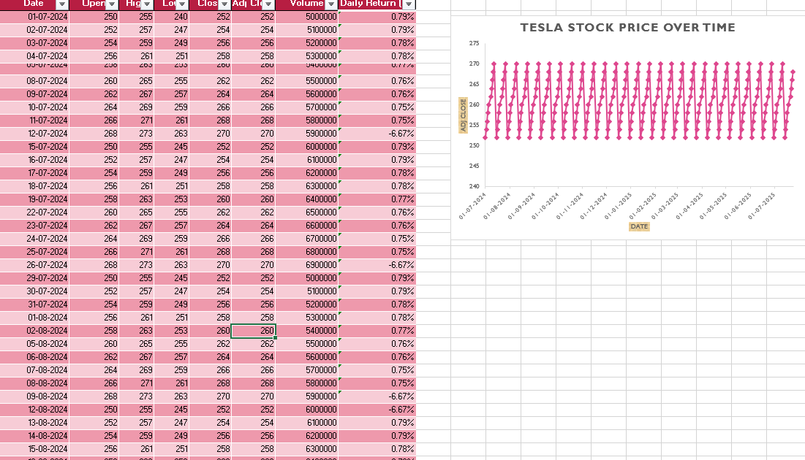
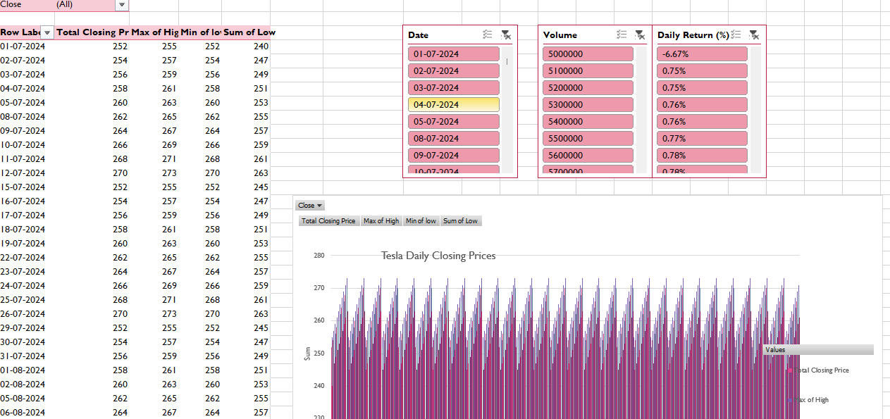

####   Tesla Stock Data Analysis (2024)

###### 

###### This project is an Excel-based data analysis of Tesla's stock performance for the year 2024. It includes daily price trends, trading volume, volatility, and insights using \*\*PivotTables\*\*, \*\*Pivot Charts\*\*, and a detailed \*\*summary\*\* of performance metrics.

###### 

* ####  Dataset Overview

#### 

####    Date Range: Full year of 2024  

#### \-  Metrics Analyzed:

######   - Daily Closing Prices

######   - Highest \& Lowest Prices

######   - Volume Traded

######   - Daily Returns (%)

#### 

#### ---

#### 

* ####   Pivot Table \& Chart Insights

#### 

####  1. Tesla Daily Stock Summary  

---

### 2. Raw Data + Interactive Pivot Chart  

#### 

###### \- The above includes:

######   - Filtered data by date, volume, and return

######   - Chart showing Tesla's daily closing price patterns

######   - Color-coded slicers for user interaction

###### 

#### ---

#### 

* ####   Key Insights

#### 

###### \-  Highest Closing Price: `$270` – Signaling peak performance days  

###### 

###### \- Lowest Closing Price: `$252` – Minimal downside observed

###### 

###### \- Average Daily % Change: `0.02%` – Stable with mild volatility 

######

###### \- Sudden Drops of -6.67%  detected – Possible major events/news

###### 

###### \- Total Volume Traded : `1.659 billion` – High market interest 

######

###### \- Average Closing Price: `$260.97` – Reflects yearly trend center

###### 

#### ---

#### 

* ####  Tools Used

#### 

###### \- Microsoft Excel

######   - PivotTables

######   - Pivot Charts

######   - Conditional Formatting

######   - Custom Summary Text Box

#### 

#### ---

#### 

####   How to View the Excel File

#### 

###### You can download and open the original Excel file from this repository. Make sure macros (if any) are enabled for full slicer and chart functionality.

#### 

#### ---

#### 

####      Author

#### 

####   Sreekha M – Aspiring Data Analyst  

####   Connect with me on \[LinkedIn](https://www.linkedin.com/in/sreekham2000)

#### 

#### ---

# Job Market Analysis – Germany (2025)

Analyzed 9,000+ European job listings using SQL & Python to uncover top in-demand skills, hiring hotspots, and role trends.  

##  Tools
- SQL  
- Python (Pandas, Matplotlib)  
- SQLite  

##  Key Insights
- Identified the **top 5 in-demand skills** across Europe (Excel, Python, Power BI, etc.)  
- Highlighted **Germany’s job hotspots** and hiring trends  
- Extracted actionable insights to guide business & hiring strategies  

## 🔗 Project Link
[Job Market Analysis – Germany](https://github.com/SREEKHA-25/job-market-analysis-germany)

